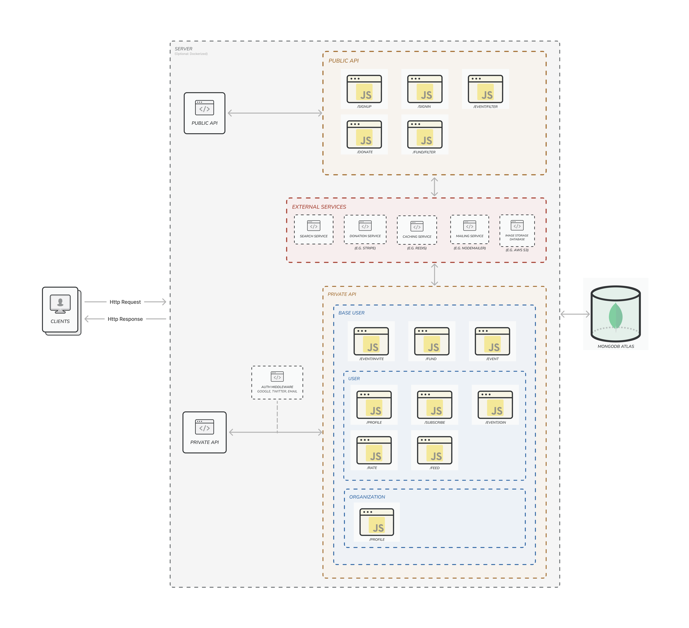
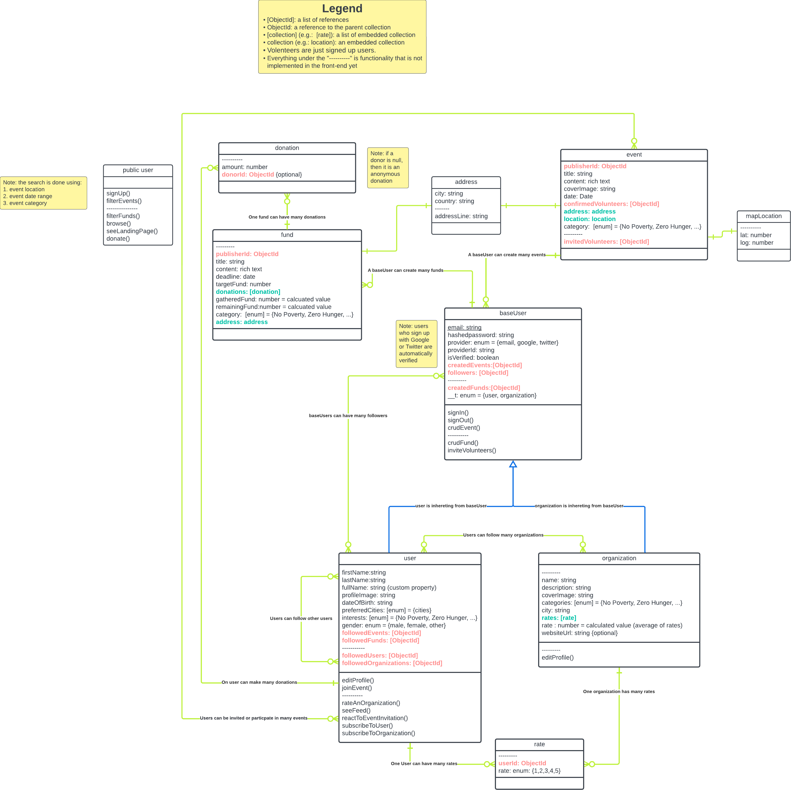
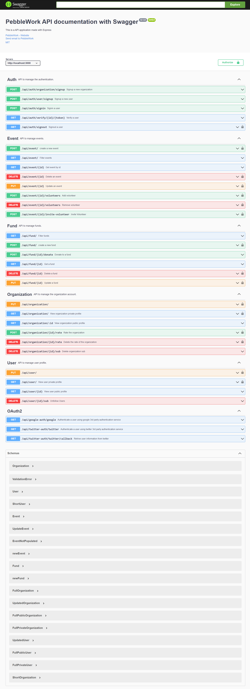

<br />
<div align="center">
  <h1 align="center">PebbleWork</h1>

  <a href="https://pebble-work.herokuapp.com/api-docs/">
    
  </a>
  <p align="center">
    Pebblework brings together people who wants to make a change <br /> in the world. It connects organizations that want to conduct events <br /> with donors and volunteers with a purpose of creating <br /> a meaningful impact. <br />
    <a href="https://pebble-work.herokuapp.com/api-docs/"><strong>Explore the docs »</strong></a>
    <br />
    <br />
    <a href="https://i.imgur.com/TxkCyZC.jpeg">View Demo</a>
    ·
    <a href="https://github.com/RCDD-202203-TUR-BEW/backend-capstone-turkey-pebble-work/issues">Report Bug</a>
    ·
    <a href="https://github.com/RCDD-202203-TUR-BEW/backend-capstone-turkey-pebble-work/issues">Request Feature</a>
  </p>
</div>

### Table of Contents

1. [About the Project](#about-the-project)
    - [Project Features](#project-features)
    - [Tools and Technologies](#tools-and-technologies)
    - [Design Diagrams](#design-diagrams)
        - [System Architecture Diagram](#system-architecture-diagram)
        - [Database Schema Design](#database-schema-design)
2. [Installation Guide](#installation-guide)
    - [Prerequisites](#prerequisites)
    - [Installation](#installation)
3. [Linked Frontend Application](#linked-frontend-application)
4. [Contributing Guide](#contributing-guide)
5. [Contributors](#contributors)
6. [License](#license)
7. [Acknowledgments](#acknowledgments)
8. [Contact](#contact)

## About the Project

The ideology behind Pebblework is creating significant outcome by gathering community members together to be a part of collective effort.

This platform is for everyone who wants to bring something big to life by giving their time, energy or financial support whether they are an organization,a volunteer or a donor.

On Pebblework, you can create an event and find volunteers that want to be a part of it or you can search for events to contribute your local community by searching categories that fit your interests based on location and time. If you don’t have time or energy but still want to support an event you can take a look at the target and remaining funds of the events and donate anonymously. Pebblework is a great platform for creating solid impact while feeling the warmth of being one with your community!

### Project Features

-   CRUD Events
-   CRUD Funds
-   Sign in/up/out
-   Volunteer for an Event
-   Invite Volunteers to an Event
-   Donate to a Fund
-   Create a user or an organization account
-   Edit user or organization account
-   Rate an organization
-   Subscribe or unsubscribe to an organization or a user
-   Get public profile of a user or organization
-   Sign in/up with Google
-   Sign in/up with Twitter

### Tools and Technologies

-   [![Figma-shield]][figma-link]
-   [![Github-shield]][github-link]
-   [![Git-shield]][git-link]
-   [![Prettier-shield]][prettier-link]
-   [![Eslint-shield]][eslint-link]
-   [![mongodb-shield]][mongodb-link]
-   [![nodejs-shield]][nodejs-link]
-   [![express-shield]][express-link]
-   [![express-validator-shield]][express-validator-link]
-   [![swagger-shield]][swagger-link]
-   [![Jest-shield]][jest-link]
-   [![JWT-shield]][jwt-link]
-   [![Passport-shield]][passport-link]
-   [![Postman-shield]][postman-link]
-   [![heroku-shield]][heroku-link]
-   [![yarn-shield]][yarn-link]
-   [![nodemailer-shield]][nodemailer-link]
-   [![google-shield]][google-link]
-   [![twitter-shield]][twitter-link]
-   [![firebase-shield]][firebase-link]
-   [![husky-shield]][husky-link]

### Design Diagrams

#### System Architecture Diagram

In this diagram, you can see the various components of our REST API, such as API routers, services, and utils, as well as our MongoDB database and how it is integrated with the rest of the project.



#### Database Schema Design

This is known as a UML diagram, and it shows the collections used in the database, their properties, the relationships between them, and the functionality that each collection (class) can have. We chose this diagram because it contains a lot of information and will help us organize our thoughts as we implement our application.



## Installation Guide

### Prerequisites

1. [Node.js](https://nodejs.org/en/)
2. [Yarn](https://yarnpkg.com/)
3. [Git](https://git-scm.com/)

### Installation

1. Clone the repo
    ```sh
    git clone https://github.com/RCDD-202203-TUR-BEW/backend-capstone-turkey-pebble-work.git
    ```
2. Navigate to the project folder

    ```sh
    cd backend-capstone-turkey-pebble-work
    ```

3. Install dependencies
    ```sh
    yarn
    ```
4. Run the project
    ```sh
    yarn start
    ```
5. Run checks and tests
    ```sh
    yarn test
    ```

## Documentation

Explore our interactive documentation API [here](https://pebble-work.herokuapp.com/api-docs/).



## Linked Frontend Application

## Contributing Guide

Contributions are what make the open source community such a wonderful place to learn, be motivated, and create. Your contributions are **deeply appreciated**.

1. Fork the Project
2. Create your Feature Branch (`git checkout -b feature/AmazingFeature`)
3. Commit your Changes (`git commit -m 'Add some AmazingFeature'`)
4. Push to the Branch (`git push origin feature/AmazingFeature`)
5. Open a Pull Request

## Contributors

|  |  |  |    |  |  |
| -------------------------------------------------------- | ------------------------------------------------------ | ---------------------------------------------------------- | ------------------------------------------------------ | ------------------------------------------------------ | ------------------------------------------------------ |
| Lead Engineer                                            | Junior Engineer                                        | Junior Engineer                                            | Junior Engineer                                        | Junior Engineer                                        | Junior Engineer                                        |
| [Halit Batur](https://github.com/halitbatur)             | [Lara Gurol](https://github.com/laragurol)             | [Mehmet Baki](https://github.com/mehmettbaki)              | [Muhammed Şihebi](https://github.com/muhammed-shihebi) | [Rama Alshaban](https://github.com/ramaalshaban)       | [Sara Hamoud](https://github.com/sarahmood)            |

## License

Distributed under the MIT License. See [LICENSE](https://choosealicense.com/licenses/mit/) for more information.

## Acknowledgments

-   [![google-shield]][google-link]
-   [![stackoverflow-shield]][stackoverflow-link]

## Contact

### PebbleWork Team

**Email:** pebbleworkplatform@gmail.com

<!-- Links -->

[stackoverflow-shield]: https://img.shields.io/badge/stackoverflow-F8F9F9?style=flat&logo=stackoverflow
[stackoverflow-link]: https://stackoverflow.com/
[heroku-shield]: https://img.shields.io/badge/heroku-7D4E89?style=flat&logo=heroku
[heroku-link]: https://www.heroku.com
[yarn-shield]: https://img.shields.io/badge/yarn-FFFFFF?style=flat&logo=yarn
[yarn-link]: https://yarnpkg.com/
[nodemailer-shield]: https://img.shields.io/badge/nodemailer-22B573?style=flat&logo=nodemailer
[nodemailer-link]: https://nodemailer.com/
[google-shield]: https://img.shields.io/badge/google-FFFFFF?style=flat&logo=google
[google-link]: https://www.google.com/
[twitter-shield]: https://img.shields.io/badge/twitter-FFFFFF?style=flat&logo=twitter
[twitter-link]: https://www.twitter.com/
[firebase-shield]: https://img.shields.io/badge/firebase-FFFFFF?style=flat&logo=firebase
[firebase-link]: https://firebase.google.com/
[husky-shield]: https://img.shields.io/badge/husky-FFFFFF?style=flat&logo=husky
[husky-link]: https://www.npmjs.com/package/husky
[postman-shield]: https://img.shields.io/badge/postman-FFFFFF?style=flat&logo=postman
[postman-link]: https://www.postman.com/
[passport-shield]: https://img.shields.io/badge/passport-FFFFFF?style=flat&logo=passport
[passport-link]: https://www.passportjs.org/
[react-shield]: https://img.shields.io/badge/react-61DAFB?style=flat&logo=react&logoColor=white
[react-link]: https://reactjs.org/
[html-shield]: https://img.shields.io/badge/html-E34F26?style=flat&logo=html5&logoColor=white
[html-link]: https://en.wikipedia.org/wiki/HTML
[css-shield]: https://img.shields.io/badge/CSS3-1572B6?style=flat&logo=css3&logoColor=white
[css-link]: https://en.wikipedia.org/wiki/CSS
[figma-shield]: https://img.shields.io/badge/Figma-F24E1E?style=flat&logo=figma&logoColor=white
[figma-link]: https://www.figma.com/
[github-shield]: https://img.shields.io/badge/github-181717?style=flat&logo=github&logoColor=white
[github-link]: https://github.com/
[git-shield]: https://img.shields.io/badge/Git-F05032?style=flat&logo=git&logoColor=white
[git-link]: https://git-scm.com/
[prettier-shield]: https://img.shields.io/badge/Prettier-F7B93E?style=flat&logo=Prettier&logoColor=white
[prettier-link]: https://prettier.io/
[eslint-shield]: https://img.shields.io/badge/eslint-4B32C3?style=flat&logo=eslint&logoColor=white
[eslint-link]: https://eslint.org/
[mongodb-shield]: https://img.shields.io/badge/mongodb-47A248?style=flat&logo=mongodb&logoColor=white
[mongodb-link]: https://www.mongodb.com/atlas/database
[nodejs-shield]: https://img.shields.io/badge/node_js-339933?style=flat&logo=node.js&logoColor=white
[nodejs-link]: https://nodejs.dev/learn/get-http-request-body-data-using-nodejs
[express-shield]: https://img.shields.io/badge/express-000000?style=flat&logo=express&logoColor=white
[express-link]: https://expressjs.com/
[express-validator-shield]: https://img.shields.io/badge/express_validator-7457c2?style=flat
[express-validator-link]: https://express-validator.github.io/docs/
[jwt-shield]: https://img.shields.io/badge/jwt-000000?style=flat&logo=json-web-tokens&logoColor=white
[jwt-link]: https://jwt.io/
[swagger-shield]: https://img.shields.io/badge/swagger-85EA2D?style=flat&logo=swagger&logoColor=white
[swagger-link]: https://swagger.io/
[jest-shield]: https://img.shields.io/badge/jest-C21325?style=flat&logo=jest&logoColor=white
[jest-link]: https://jestjs.io/
[cron-shield]: https://img.shields.io/badge/node_cron-185717?style=flat
[cron-link]: https://en.wikipedia.org/wiki/Cron
[aws-shield]: https://img.shields.io/badge/Amazon_AWS-232F3E?style=flate&logo=Amazon-AWS&logoColor=white
[aws-link]: https://en.wikipedia.org/wiki/Amazon_Web_Services
